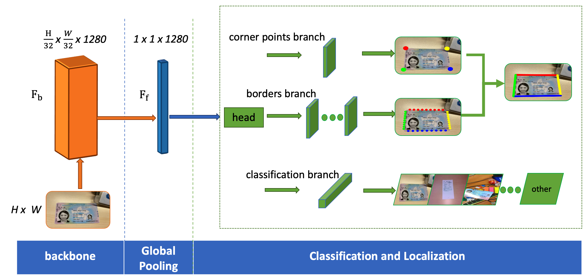
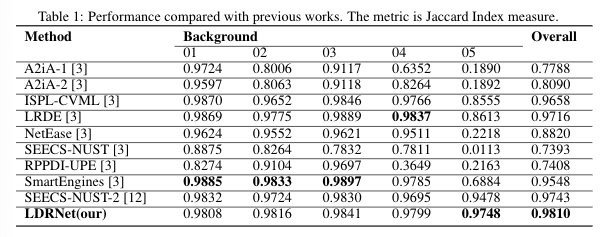
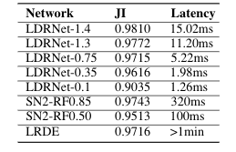

## Introduction
LDRNet is lightweight deep neural network for localizing document in a image/photo with extremely low latency. Given any image as input, LDRNet predicts the coordinates of the document's quadrilateral corners in real-time.



## Requirements
* tensorflow==2.3.1
* tensorflow-addons==0.11.2
* opencv-python==4.4.0.46
* numpy==1.18.5

## Predict
A simple example for predicting the quadrilateral corners of the image in <em>imgs</em> folder:
```
python3 predict.py
```

## Train
```
CUDA_VSIBLE_DEVICES=0 python3 train.py --config_file ./config.yaml
```
* fill the label_path and img_folder_path in config.yaml
* label consists of 18 elements: file name, eights floats for four coordinates, eights float for weights(set to 0.0625), class index(start from 0)
